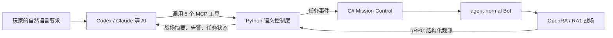

<p align="center">
  
</p>

<h1 align="center">OpenRA Commander</h1>

<p align="center">
  让 Codex、Claude 等 AI 读懂《红色警戒 1》的战场，并像指挥官一样向游戏内 Bot 下达战术任务。
</p>

> [!IMPORTANT]
> 这是 **RA1（Red Alert）** 项目，不是 RA2 模组。当前版本面向 Windows，使用仓库内修改过的 OpenRA 引擎。

## 这个项目用了什么框架？

它不是让 AI 看屏幕、模拟鼠标点击，而是把游戏改造成一套 AI 能理解和操作的“工具”。核心底座是 [OpenRA](https://www.openra.net/) 和 [OpenRA-RL](https://github.com/yxc20089/OpenRA-RL)，再通过 MCP 把这些能力交给外部 AI 客户端。

| 层 | 使用的框架或技术 | 在项目里的作用 |
| --- | --- | --- |
| 游戏层 | **OpenRA（C#）** | 运行 RA1 战场、单位、经济和原生 Bot；本项目在引擎内增加观测与任务控制模块。 |
| AI 环境层 | **OpenRA-RL（Python）** | 提供连接 OpenRA 的基础代码、数据模型和进程管理能力，是本项目的上游框架。 |
| 游戏通信 | **gRPC + Protocol Buffers** | 把金钱、单位、敌情、地图和游戏进度等结构化状态从 OpenRA 传给 Python。 |
| AI 工具接口 | **MCP（Model Context Protocol）** | 把“读战场、看告警、下任务”等能力注册成 Codex、Claude 可以调用的工具。 |
| 战术控制 | **OpenRACommander Mission Control** | 将 AI 的自然语言意图变成 `attack`、`capture`、`produce`、`build` 等任务，并跟踪执行状态。 |

简单说：**OpenRA 负责运行游戏，OpenRA-RL 负责连接游戏，MCP 负责把游戏能力交给 AI，OpenRACommander 负责把 AI 的战术任务安全地交给 Bot 执行。**

## AI 是怎样玩 RA1 的？



AI 扮演的是“指挥官”，游戏内 `agent-normal` Bot 扮演“执行部队”：

- AI 判断当前局势，决定进攻哪里、占领哪个目标或先生产什么。
- Bot 负责采矿、建造、编队、寻路和具体单位操作。
- AI 暂时断开时，Bot 仍会继续经营和战斗，不会让整局游戏停住。
- AI 看到的是带语义的战场摘要，而不是内部单位编号或原始画面像素。

例如，你可以直接说：

> 先读取战场，组织部队占领中间偏西的油井；如果没有工程师就先生产一个，再继续执行。

## 当前能力

- 启动一个可见的 RA1 对局，默认地图为 `Agenda`。
- 读取经济、兵力、建筑、可见敌人、地图区域和关键据点。
- 接收低电力、资源紧张、区域威胁等战场告警。
- 下达进攻、占领、生产和建造任务。
- 查询任务的 `accepted`、`blocked`、`in_progress`、`succeeded` 或 `failed` 状态。
- 取消任务，并保留任务审计与回放对照数据。

## 快速开始

### 准备条件

- Windows 10 或 Windows 11
- Git for Windows
- Python 3.10 或更高版本
- .NET 8 SDK
- 支持 MCP 的 AI 客户端，例如 Codex 或 Claude

### 1. 克隆并安装

```powershell
git clone --recurse-submodules https://github.com/DrErwin/openra-commander-ra1.git
cd openra-commander-ra1
powershell -ExecutionPolicy Bypass -File .\setup-ra1.ps1
```

安装脚本会准备 Python 虚拟环境、安装控制端依赖，并编译本项目固定的 OpenRA RA1 引擎。首次安装需要联网下载依赖。

### 2. 启动游戏

```powershell
powershell -ExecutionPolicy Bypass -File .\play-ra1.ps1
```

游戏启动后，终端会打印当前会话专用的 MCP 配置。把这段配置加入 AI 客户端，即可让 AI 读取战场并下达任务。

无桌面的测试环境可以使用：

```powershell
powershell -ExecutionPolicy Bypass -File .\play-ra1.ps1 -Headless
```

### 3. 停止游戏

```powershell
powershell -ExecutionPolicy Bypass -File .\stop-ra1.ps1
```

更完整的安装和操作说明见 [RA1-QUICKSTART.md](RA1-QUICKSTART.md)。

## AI 可以调用的工具

本项目只向 AI 暴露五个高层工具，避免让模型处理几十个零散的单位控制指令。

| 工具 | 用途 |
| --- | --- |
| `read_battlefield` | 读取当前经济、部队、敌情、地图区域和关键据点。 |
| `get_alerts` | 获取低电力、敌军威胁、占领机会等重要提醒。 |
| `read_missions` | 查询当前与历史任务的执行状态。 |
| `issue_mission` | 下达进攻、占领、生产或建造任务。 |
| `cancel_mission` | 取消指定任务。 |

> [!NOTE]
> MCP 只负责连接 AI 与游戏，不绑定某一家模型。只要客户端支持 MCP，就可以在同一套游戏接口上更换不同 AI。

## 项目结构

```text
openra-commander/
├── OpenRA/                 # 修改过的 OpenRA 引擎与 C# 游戏内控制模块
├── openra_env/             # OpenRA-RL Python 层、gRPC 客户端和 MCP 服务
├── commander/              # 本项目的运行器、测试、演示与运行时数据
├── proto/                  # gRPC / Protocol Buffers 协议定义
├── setup-ra1.ps1           # 安装与编译
├── play-ra1.ps1            # 启动可见或无界面游戏
└── stop-ra1.ps1            # 停止当前游戏会话
```

## 常用检查

```powershell
# 查看游戏与监督进程状态
.\.venv\Scripts\python.exe commander\scripts\live_operator.py status

# 查看 AI 当前能读到的战场、告警和任务
.\.venv\Scripts\python.exe commander\scripts\live_operator.py observe

# 重新打印 MCP 客户端配置
.\.venv\Scripts\python.exe commander\scripts\live_operator.py mcp-config
```

启动失败时，查看 `commander\evidence\live-operator.log`。

## 当前边界

- 当前发布目标是 RA1，不包含 RA2。
- AI 下达的是高层战术任务，不直接控制每一个单位的每一步移动。
- 默认单局启动不保证固定阵营与出生点；固定配置用于自动化验收。
- 可见窗口需要交互式 Windows 桌面；自动化测试可使用 `-Headless`。
